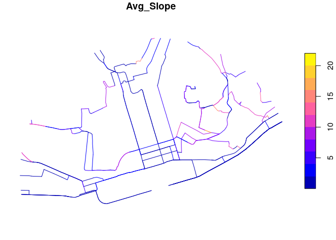

<!-- README.md is generated from README.Rmd. Please edit that file -->

# sloperouting

<!-- badges: start -->

<!-- badges: end -->

The goal of sloperouting is to provide a place to share code/data for
slope sensitive routing.

The starting point is having the latest version of `sfnetworks`
installed:

``` r
remotes::install_github("luukvdmeer/sfnetworks")
remotes::install_github("itsleeds/slopes")
remotes::install_github("itsleeds/od")
```

``` r
library(sfnetworks)
library(tidygraph)
#> 
#> Attaching package: 'tidygraph'
#> The following object is masked from 'package:stats':
#> 
#>     filter
library(dplyr)
#> 
#> Attaching package: 'dplyr'
#> The following objects are masked from 'package:stats':
#> 
#>     filter, lag
#> The following objects are masked from 'package:base':
#> 
#>     intersect, setdiff, setequal, union
library(sf)
#> Linking to GEOS 3.8.0, GDAL 3.0.4, PROJ 7.0.0
```

Test the package is working:

``` r
net = as_sfnetwork(roxel, directed = FALSE)
class(net)
sf::st_crs(net)
net_proj = sf::st_transform(net, 3035)
p1 = net_proj %>%  
  activate(nodes) %>%  
  st_as_sf() %>%  
  slice(1)  
p2 = net_proj %>%  
  activate(nodes) %>%  
  st_as_sf() %>%  
  slice(9)  
p3 = sf::st_sfc(  
  sf::st_geometry(p1)[[1]] + sf::st_point(c(500, 500)),  
  crs = sf::st_crs(p1)  
)  
p4 = sf::st_sfc(  
  sf::st_geometry(p2)[[1]] + sf::st_point(c(-500, -500)),  
  crs = sf::st_crs(p2)  
)  
net_proj %>%  
  activate("edges") %>%  
  mutate(weight = edge_length()) %>%  
  convert(to_spatial_shortest_paths, p3, p4) ->  
  net_sp  
par(mar = c(1,1,1,1), bg = NA)  
plot(net_proj)  
plot(net_sp,
     col = "Orange", lwd = 1.5, cex = 1.5,
     add = T)
```

``` r
r = slopes::lisbon_road_segments
class(r)
#> [1] "sf"         "tbl_df"     "tbl"        "data.frame"
names(r)
#>  [1] "OBJECTID"   "fid_1"      "gradient_s" "Shape_Leng" "Z_Min"     
#>  [6] "Z_Max"      "Z_Mean"     "SLength"    "Min_Slope"  "Max_Slope" 
#> [11] "Avg_Slope"  "z0"         "z1"         "gradverifi" "query"     
#> [16] "lat"        "lon"        "lat_min"    "lat_max"    "lon_min"   
#> [21] "lon_max"    "bbox"       "geom"
plot(r["Avg_Slope"])
```

<!-- -->
